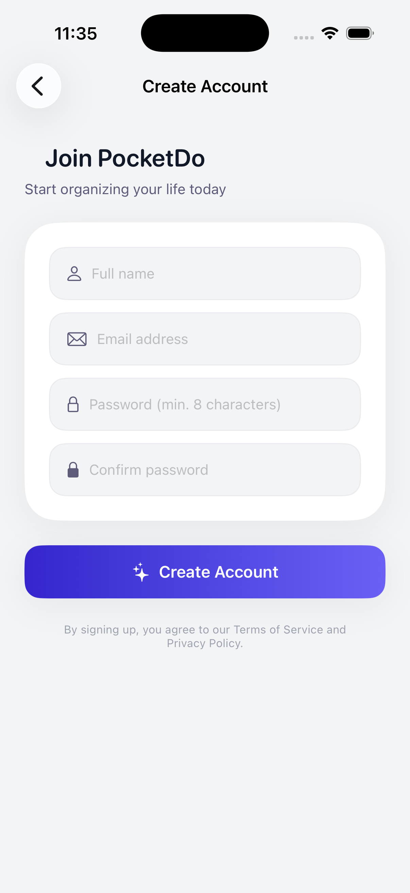
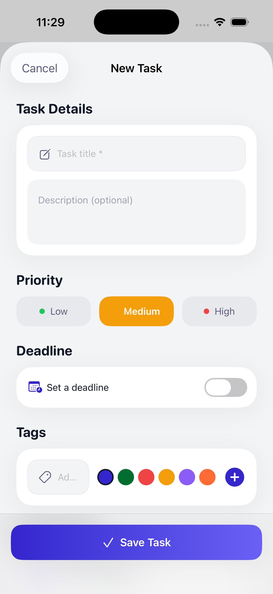
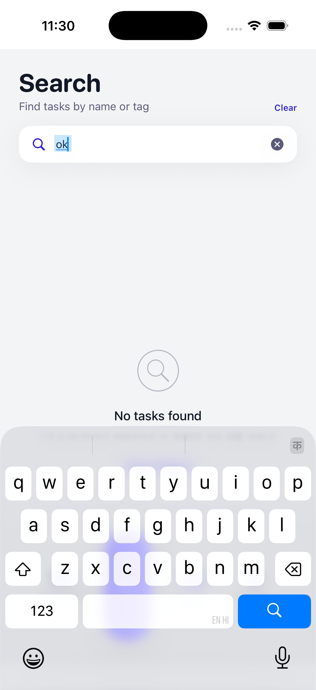
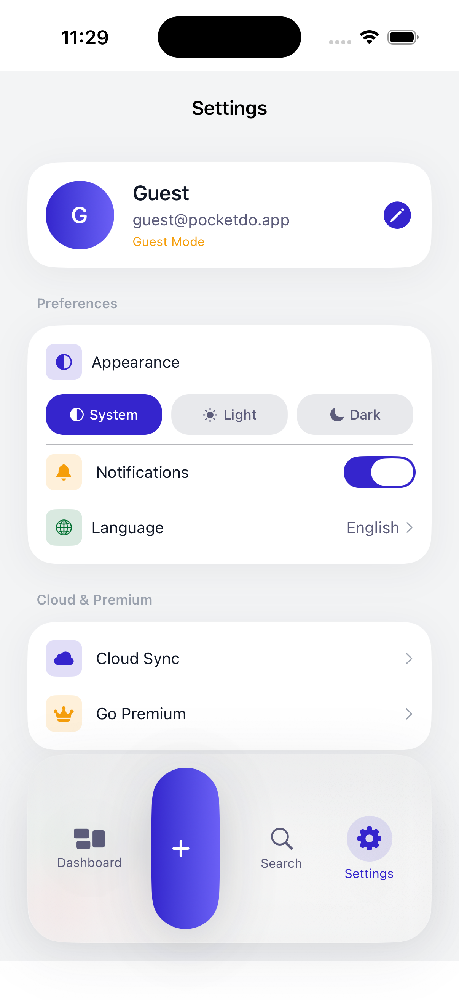

<div align="center">

# POCKETDO 📱

### Minimalist local-first task manager for iOS using CoreData and SwiftUI


</div>

---

## 📸 Screenshots

### Login & Authentication

<div align="center">


</div>

### Dashboard & Tasks

<div align="center">



</div>

### Settings & Premium

<div align="center">


</div>

---

## ✨ Features

| Feature                        | Status |
| ------------------------------ | ------ |
| 🔐 User Authentication         | ✅     |
| 📦 Offline-First with CoreData | ✅     |
| 📝 Task Management             | ✅     |
| 🏷️ Tags & Categories           | ✅     |
| 🔍 Search & Filter             | ✅     |
| 🌙 Dark Mode                   | ✅     |
| ☁️ Cloud Sync (Premium)        | 🚧     |
| 🎨 Clean SwiftUI Interface     | ✅     |
| 🧪 Unit Tests                  | ✅     |

---

## 🏗️ Architecture

This project follows **Clean Architecture** principles with clear separation of concerns:

```
Presentation Layer   →   Domain Layer   →   Data Layer
    (UI/Views)         (UseCases/Entities)   (Repositories/DataSources)
```

### Architecture Layers:

- **Presentation**: SwiftUI views, ViewModels, and UI components
- **Domain**: Business logic with UseCases and Entities
- **Data**: Repository implementations with local (CoreData) and remote data sources

---

## 🛠️ Tech Stack

| Category             | Technology                   |
| -------------------- | ---------------------------- |
| Language             | Swift 5.9+                   |
| UI Framework         | SwiftUI                      |
| Reactive             | Combine                      |
| Database             | CoreData (Local-first)       |
| Architecture         | Clean Architecture           |
| Dependency Injection | Manual (DependencyContainer) |
| Testing              | XCTest                       |

---

## 🚀 Getting Started

### Prerequisites

- Xcode 15+
- iOS 16+ simulator or device
- Swift 5.9+

### Installation

```bash
# Clone the repository
git clone https://github.com/ram7767/pocketdo.git
cd pocketdo

# Open in Xcode
open pocketdo.xcodeproj

# Build and run (Cmd+R)
```

### Project Setup

1. Open `pocketdo.xcodeproj` in Xcode
2. Select your target device/simulator
3. Build and run - no additional setup required!

---

## 📁 Project Structure

```
pocketdo/
├── App/                      # App entry point & routing
│   ├── pocketdoApp.swift    # Main app entry
│   ├── AppRouter.swift      # Navigation routing
│   ├── DependencyContainer.swift  # DI container
│   └── MainTabView.swift    # Main tab structure
│
├── Features/                 # Feature modules
│   ├── Auth/                # Authentication feature
│   │   ├── Views/
│   │   └── ViewModels/
│   ├── Dashboard/           # Main dashboard
│   ├── Task/                # Task management
│   ├── Search/              # Search functionality
│   ├── Settings/            # App settings
│   └── Premium/             # Premium features
│
├── Domain/                   # Business logic layer
│   ├── Entities/            # Core data models
│   ├── Repositories/        # Repository protocols
│   └── UseCases/            # Business logic use cases
│
├── Data/                     # Data layer
│   ├── RepositoriesImpl/    # Repository implementations
│   └── DataSources/         # Local & remote data sources
│       └── Local/           # CoreData implementations
│
├── Core/                     # Shared utilities
│   ├── Components/          # Reusable UI components
│   ├── Extensions/          # Swift extensions
│   ├── Theme/               # App theming
│   └── Utilities/           # Helper utilities
│
├── Services/                 # App services
└── Resources/               # Assets & configurations
```

---

## 🗺️ Roadmap

- [x] Core architecture setup
- [x] Authentication flow
- [x] Task CRUD operations
- [x] Offline-first with CoreData
- [x] Search & filter functionality
- [x] Settings & preferences
- [ ] Cloud sync (Premium)
- [ ] iPad / tablet layout
- [ ] Localization (i18n)
- [ ] Widgets
- [ ] Performance optimizations
- [ ] App Store release

---

## 📖 Documentation

For detailed architecture and design decisions, see [DESIGN.md](DESIGN.md).

---

## 🤝 Contributing

Contributions are warmly welcome!

1. Fork the repository
2. Create your branch: `git checkout -b feature/amazing-feature`
3. Commit your changes: `git commit -m 'feat: add amazing feature'`
4. Push the branch: `git push origin feature/amazing-feature`
5. Open a Pull Request

Please follow [Conventional Commits](https://www.conventionalcommits.org/) for commit messages.

---

## 📄 License

Distributed under the MIT License. See `LICENSE` for details.

---

<div align="center">

Made with ❤️ by [@ram7767](https://github.com/ram7767)

⭐ Star this repo if you found it helpful!

</div>
